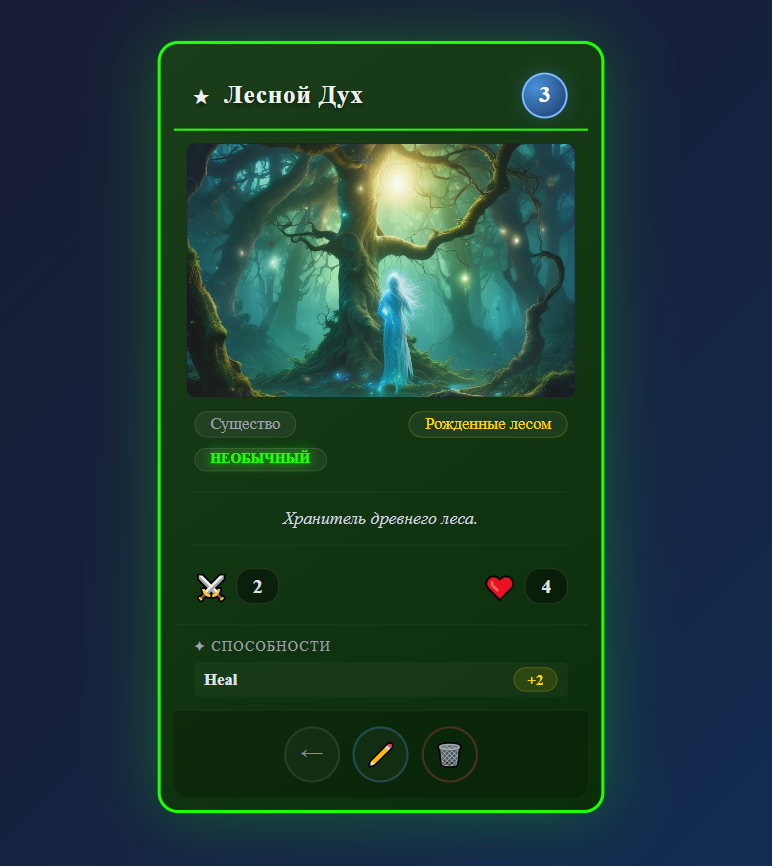
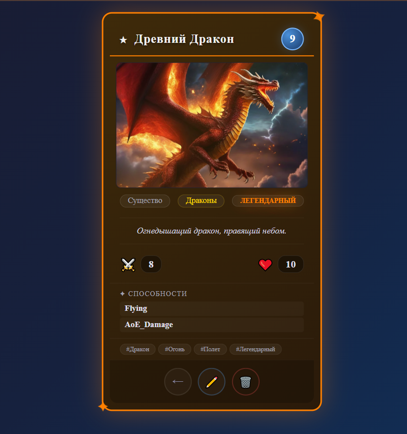

# Игра Symfony Duel - 0.0.1
## Коллекционная карточная игра

Игра для учебного проекта по Symfony\
В первый прототип закладываю стандартную механику ККИ игр с 1 игровым полем\

## Примеры карты

<table>
  <tr>
    <td align="center">
      
      <br>
      <b>🌿 Лесной Дух</b>
      <br>
      <sub>⚔️ 2 ❤️ 4 💎 3</sub>
    </td>
    <td align="center">
      
      <br>
      <b>🐉 Древний Дракон</b>
      <br>
      <sub>⚔️ 8 ❤️ 10 💎 9</sub>
    </td>
  </tr>
</table>


## Установка проекта

```bash
docker compose up -d
docker exec -it php-card bash
```
Добавить карты:
```bash
php bin/console doctrine:fixtures:load
```
Миграции (создать):
```bash
php bin/console make:migration
```
Миграции (применить)
```bash
php bin/console doctrine:migrations:migrate
```
```bash
php bin/console doctrine:migrations:diff
```

Полезное (проверить структуру):
```bash
php bin/console doctrine:schema:validate
```

## Этапы:
1. Создание сущностей и репозиториев (Карты, типы карт, расы, редкость, способности + особенности карты, теги)
2. Создание сервисов для боевой системы
3. Создание сервисов для хода 
4. Создание сервисов для поля (стол для игры)
5. Создание сервиса для формирования "Руки" в начале хода
6. Создание сервисов для игрока (Сервис основной игровой механики)
7. Создание новой сущности "Пользователь", "Колоды", "КолодыПользователей"
8. Авторизация пользователя
9. Подготовка API эндпойнтов для экшенов игры (Используем "Веб-сокет")
10. Формирование меню (Фронтенд будет всего 2 пункта "Игра с компьютером" и "Библиотека карт")
11. Шаблон игрового поля (Фронтенд)
12. Шаблон руки (Фронтенд)
13. Шаблон карт (Фронтенд)
14. Простая игровая анимация и взаимодействие с элементами игры (Фронтенд)
15. Шаблон раздела "Библиотеки" для добавления новых колод (Фронтед)
16. Игра с компьютером (Создание простого АИ для игры с компьютером)
17. Персонализация колод и прогресса пользователя

## Дополнительные этапы:
1. Добавить сущность/таблицу "Игры" (храним текущие состояния запущенных игр в json храним состояние руки + поля + колод)
2. Добавить сущность/таблицу "Ходы" (для тестирования + реализации системы достижений)
3. Восстановление игры (сохранение)
4. Музыкальное сопровождение (звуки действий, звуки карт + музыка основной игры)

## Типы карт:
* ✨ Заклинания*
* ⚔️ Артефакты*
* 🗡️ Существа*
*  ⚡ Карты действия
* 🛡️ Карты поддержки
* 🗺️ Карты игрового поля

Для первой версии реализуем типы со звездочкой *

### ✨ Заклинания
Урон по 1 карте или сразу по всем\

В развитие проекта хотелось бы добавить магию с уникальной механикой\
Например:
* На 3 существа сразу
* Фатальный урон на 1 единицу
* Превратить существо противника в 🐑

### ⚔️ Артефакты
Карты, которые будет улучшать карту существа на поле\
Карта "Доспех" даст +3 очка ХП карте на поле

### ️ 🗡️ Существа
Карта напрямую взаимодействует с игровым полем (Каждый ход карта имеет право - атаковать заново) 
Карта может иметь способности провокация, блокировка урона (abilities.yaml)
В развитие проекта хотелось:\
Например при розыгрыше, при смерти, уникальные механики

### ⚡ Карты действия
Карты с уникальным действие, например получить 1 из 3 карт на выбор

### 🛡️ Карты поддержки
Фиксированная карта - статичная - но с количеством "Зарядов"
Устанавливается на поле в отдельную ячейку - может быть сломано картой "Действий"

### 🗺️ Карты игрового поля
Например, карта "Тёмный дождь" на 3 хода дает вероятность что некоторые карты противника\
пропустят свой ход с вероятностью 30%

Такие карты могут создавать улучшения на все существа сразу - либо добавлять преграды для карт противника\
(Преграды и изменение игровой структуры поля необходимо спроектировать - сложная механика*)

### 🏛️ Постройки/Строения (новый тип карт*)
Карты построек используются для дополнительного поля на поле игры
Данная карта разбавляет механику игры стратегической составляющей
Для баланса также будут существовать карта по типу "Баллиста" - разрушаем 1 здание
Опять же в этой механике интересно будут смотреться "Строительные" способность
Карты построек - имеют время постройки - количество единиц здоровья (Может быть убрано)
Карта построек - может добавлять вам в руку 1 карту, каждый второй ход либо n ход
Карты построек могут давать вам положительные эффекты на поле битвы, а также отрицательные для противника
Кузница сможет создавать доспехи, гильдия магов даст карту случайной магии, "Ущелье драконов через 10 ходов"
даст легендарного дракона вам в руку! (после чего его засыпет камнями)
У данной карты есть регулярное - так и одноразовые эффекты
Вы можете разрушить здание - для постройки нового (что-то неудачно построили, либо уже от здания прока нет)

### 🧙 Карты героев (новый тип карты*)
Для каждой расы будут доступны карты героев (отличаются интересными особенностями и мастерством)
(Герои могут влиять на все аспекты игры)
Карты героев относятся к 1 виду расы - открывают доступ к определенным постройкам
Герой постройка - звучит интересно (Ходячий гигант с башнями на плечах)

### 🗿 Нейтральная раса (перенести в раздел расы*)
Доступны всем героям, постройки, заклинания все виды карт можно дособирать в колоду любой 
фракции

## Библиотека карт:
Список карты + фильтры + колоды пользователя

## Особенности как открытого проекта*:
* Добавление новых рас
* Добавление новых карт
* Добавление новых способностей
* Добавление своих особенных способностей (Через специальные классы) для редких карт

Каждый пользователь имеет разрешение на добавление своих карт в проект 
через систему MR (новые yaml файл + особенности карт с механикой)

На данный момент использую "Фикстуры" с yaml файлами для добавления контента src/DataFixtures/Data
(Необходимо реализовать автоматическую сборку json схемы для подсказок ide для удобства заполнения)

## Сущности проекта (базовые)

* Карта (основная сущность)
* Раса
* Тип карты
* Редкость
* Способности карт
* Особенности (Реализовать через классы PHP) - для сложной уникальной механики карт
* Теги карт (для упрощения работы с особыми условиями + фильтр)

## Спецификация таблиц:
https://dbdiagram.io/d/6a5399c936d348d120c4464b

## История
n/a

## Стилистика карт
Пиксель Арт + фэнтези вселенная (паровые машины, магия, мифические существа)
Для изображений использую https://www.artbreeder.com/tools/prompter
Игровые иконки https://game-icons.net/
Комьюнити сможет присылать свои арт работы для карт 
(Необходимо подписывать арт работы* разработка на будущее)

## Звуковое сопровождение и музыка
Каждая раса героя дает определенную композицию на поле боя 
(Создаёт целостность каждой фракции)
В меню и в библиотеке карт разные композиции
Звуки для появления карт на поле боя

## Боевая система
Задача: победить вражеского героя на поле боя
Игровое поле состоит из 2х частей (1 часть для существ, вторая для строений)\
Система с наполнением маны с каждым ходом до 9 маны\
30 хп у героев (в зависимости от карт)
Открытие дополнительных карт через скрытый механизм с загадкой в описании карты (Новая механика загадок) 
К механике загадок можно прикрутить здания - например таверна, которая могла бы замолвить слух про определенную загадку
Новый тип карт строения! (Обдумать механику) отдельное поле для построек - оборона замка - башни - колодцы для маны


## Развитие проекта (Не входит в базовый проект)
1. Создание сервиса для работы с достижениями (Открытие новых карт - система крафта)
2. Добавить возможности игры по ссылке с другом
3. Реализация игры "онлайн" дуэли
4. Добавление режима "арена"
5. Добавление "компании/истории"
6. Добавления режима головоломок
7. Добавить генератор собственных карт и механик (генерация картинки за счет заполненных данных - но в рамках стилистики проекта)
(конструктор правил - каждый пользователь может создать свою уникальную механику)
8. Добавление глобального рейтингового режима (с таблицей лидеров)