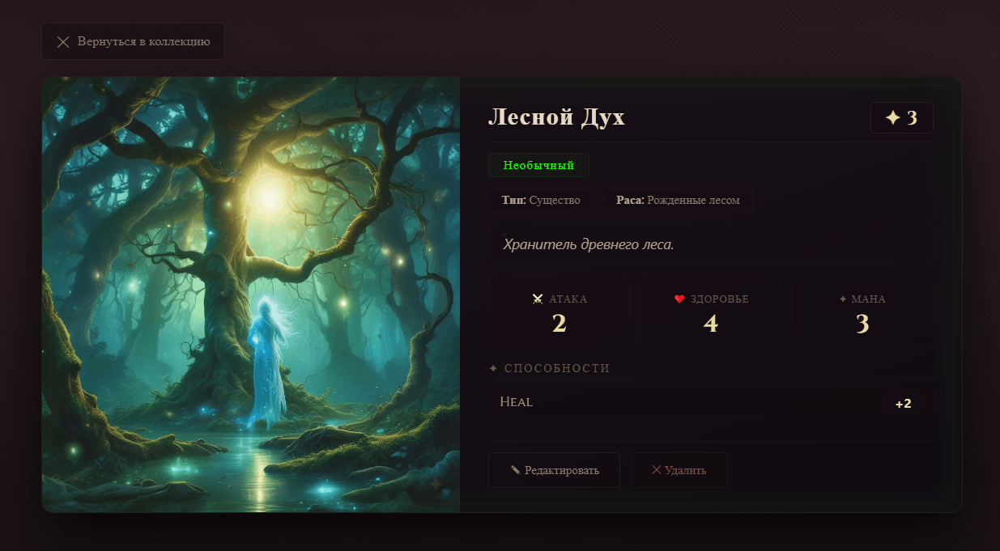
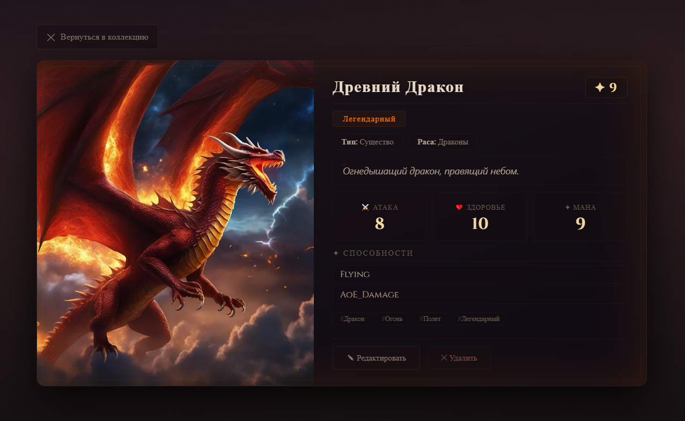
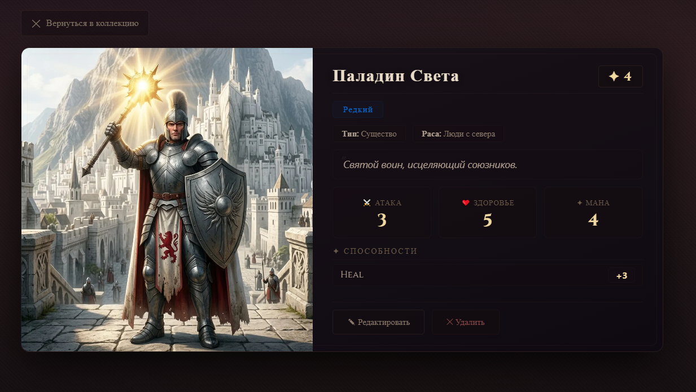
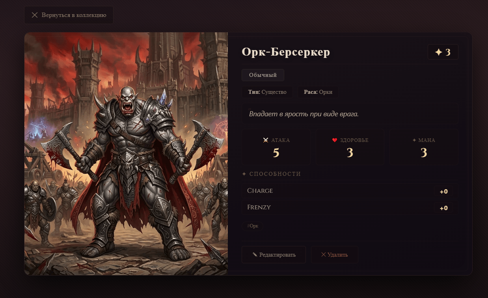

# Игра Symfony Duel - 0.0.1
## Коллекционная карточная игра

Игра для учебного проекта по Symfony\
В первый прототип закладываю стандартную механику ККИ игр с 1 игровым полем\

## Примеры карты

<div align="center">
  
  <br>
  <b>🌿 Лесной Дух</b>
  <br>
  <sub>⚔️ 2 ❤️ 4 💎 3</sub>
</div>

<br>

<div align="center">
  
  <br>
  <b>🐉 Древний Дракон</b>
  <br>
  <sub>⚔️ 8 ❤️ 10 💎 9</sub>
</div>

<br>

<div align="center">
  
  <br>
  <b>⚔️ Паладин Света</b>
  <br>
  <sub>⚔️ 3 ❤️ 5 💎 4</sub>
</div>

<br>

<div align="center">
  
  <br>
  <b>💀 Орк-Берсеркер</b>
  <br>
  <sub>⚔️ 5 ❤️ 3 💎 3</sub>
</div>

## Установка проекта

```bash
docker compose up -d
docker exec -it php-card bash
```
1. Миграции — создать таблицы:
```bash
php bin/console doctrine:migrations:migrate
```
2. Тестовые пользователи (только для разработки). `fixtures:load` очищает **всю** базу, поэтому — до импорта контента:
```bash
php bin/console doctrine:fixtures:load
```
3. Ключи подписи JWT (в git не хранятся — `config/jwt/*.pem`):
```bash
php bin/console lexik:jwt:generate-keypair
```
4. Контент — справочники, карты и базовые колоды из `data/content`:
```bash
php bin/console app:content:import --dry-run          # показать, что изменится
php bin/console app:content:import                    # применить
php bin/console app:content:import --delete-missing   # также удалить карты, которых нет в контенте (с картинками)
```

Тесты — на отдельной базе `cards_test` (рабочая база не трогается):
```bash
APP_ENV=test php bin/console doctrine:database:create --if-not-exists
APP_ENV=test php bin/console doctrine:migrations:migrate -n
APP_ENV=test php bin/console app:content:import
php bin/phpunit
```

Миграции при разработке (создать по изменениям сущностей):
```bash
php bin/console make:migration
php bin/console doctrine:migrations:diff
```

Полезное (проверить структуру):
```bash
php bin/console doctrine:schema:validate
```

## API и авторизация

Сайт работает на сессии (вход через форму, кука, «Запомнить меня»).
API (`/api/*`) — **stateless**: сессии нет, каждый запрос сам несёт токен. Токенов два вида:

| | API-токен | JWT |
|---|---|---|
| Для чего | долгоживущий ключ для скриптов, ботов, интеграций | сессия игрока: игровой клиент, игровые партии в реальном времени |
| Получить | `POST /api/tokens` `{"email", "password"}` | `POST /api/login` `{"email", "password"}` → `token` + `refresh_token` |
| Передавать | `X-Api-Token: duel_…` | `Authorization: Bearer eyJ…` |
| Срок | 30 дней | JWT — 15 минут, refresh-токен — 30 дней (одноразовый) |
| Проверка | хеш токена ищется в таблице `api_tokens` | подпись ключом — **без обращения к базе** |
| Отзыв | `DELETE /api/tokens/current` | истекает сам; новый — `POST /api/token/refresh` `{"refresh_token"}` |

```bash
# JWT: вход и запрос
curl -X POST localhost:7777/api/login -H 'Content-Type: application/json' -d '{"email":"player@duel.ru","password":"password"}'
curl localhost:7777/api/me -H 'Authorization: Bearer <token>'

# API-токен
curl -X POST localhost:7777/api/tokens -H 'Content-Type: application/json' -d '{"email":"creator@duel.ru","password":"password"}'
curl localhost:7777/api/me -H 'X-Api-Token: duel_…'
```

### Зачем JWT
JWT — основа игровых сессий. Партия будет идти в реальном времени (WebSocket / Mercure), а такой сервер
работает отдельным процессом: у него нет доступа к PHP-сессии сайта, а ходить в базу на каждое сообщение — дорого.
JWT проверяется только по подписи: сервер партии сразу знает id игрока и его роли.
- ход игрока — запрос к API с JWT (`Authorization: Bearer …`);
- состояние партии рассылается игрокам в реальном времени; доступ к каналу партии — тоже по JWT
  (только участники этой партии).

Короткий срок жизни JWT (15 минут) — потому что отозвать выданный JWT нельзя; клиент продлевает его refresh-токеном.

### Партии через API (JWT)
| Запрос | Что делает |
|---|---|
| `GET /api/decks` | колоды, которыми можно играть: базовые и свои |
| `GET /api/games` | партии, к которым можно присоединиться (`waiting`), и свои незавершённые (`mine`) |
| `POST /api/games` `{"deckId"}` | создать партию — ждёт второго игрока |
| `POST /api/games/{id}/join` `{"deckId"}` | присоединиться — партия начинается, кто ходит первым — жребий |
| `POST /api/games/computer` `{"deckId"}` | игра с компьютером — начинается сразу; после вашего хода компьютер играет свой в том же запросе |
| `GET /api/games/{id}` | партия глазами игрока (только участникам) |
| `GET /api/games/{id}/subscription` | подписка на события партии в реальном времени: `{"hub", "topic", "token"}` |
| `POST /api/games/{id}/actions` | ход: `{"type": "play_card", "cardId", "cell", "targetId"}`, `{"type": "attack", "attackerId", "targetId"}`, `{"type": "capture_point", "creatureId", "point"}`, `{"type": "end_turn"}`, `{"type": "surrender"}` (можно и в чужой ход) |

Ответ на ход — события (`events`) и новое состояние (`state`). Клиент видит только своё: рука и колода
противника — числом карт, его существа под Туманом скрыты, взятые им карты — тоже.
Ошибки — JSON `{"error"}`: 422 — ход не по правилам (партия не изменилась), 409 — партия уже идёт / изменилась
другим запросом, 403 — чужая партия или колода.

Состояние партии хранится в `games.state` (JSON) вместе с описаниями карт — правки контента не ломают идущие партии.

**Время на ход** — 90 секунд (`app.game.turn_seconds` в `config/services.yaml`). Истекло — ход завершается за игрока.
Фонового процесса нет: срок проверяется при любом обращении к партии (`GET /api/games/{id}`, ход); страница соперника
сама запрашивает партию, когда отсчёт доходит до нуля. В ответе — `game.turnDeadline` и `game.serverTime` (для отсчёта в браузере).
Время в коде — через Symfony Clock (`ClockInterface`): в тестах его «перематывают» (`mockTime()`, `$clock->sleep(91)`).

### Реальное время (Mercure)
После старта партии и каждого хода сервер публикует участникам событие через хаб Mercure
(контейнер `mercure-card`, порт 3000). У каждого игрока свой приватный топик `/users/{id}/games/{gameId}`
и своё содержимое — то же, что в ответе API: чужая рука и туман скрыты.
```bash
# токен подписчика — по JWT, только участникам партии
curl localhost:7777/api/games/1/subscription -H 'Authorization: Bearer <jwt>'
# поток событий (SSE): хаб — протокол Mercure 1.0, подписка параметром match
curl -N 'http://localhost:3000/.well-known/mercure?match=/users/5/games/1' -H 'Authorization: Bearer <token>'
```
Хаб принимает только токены доверенного издателя: `MERCURE_JWT_ISSUER` (.env) = `MERCURE_TRUSTED_ISSUERS` (docker-compose.yml),
ключ — `MERCURE_JWT_SECRET` = `MERCURE_*_JWT_KEY`. В `.env` — ключ для разработки; на сервере — свой, случайный (`.env.local`).
Хаб недоступен — ход всё равно сохраняется, состояние можно получить через `GET /api/games/{id}`.

## Механика игры
Правила партии и способности карт — [docs/game-rules.md](docs/game-rules.md). Движок — `src/Game/`, тесты:
```bash
php bin/phpunit tests/Game
```

Компьютерный соперник (`src/Game/Ai/ComputerPlayer`) — жадный, на один ход вперёд: пробует каждый возможный ход
через движок на копии партии и делает тот, после которого позиция лучше (фортификации, существа, точки).
Правил не повторяет — новые способности учитывает сам. Баланс базовых колод — компьютер против компьютера:
```bash
php bin/console app:game:simulate --games=50
```

## Этапы:
1. Создание сущностей и репозиториев (Карты, типы карт, расы, редкость, способности + особенности карты, теги)
2. Создание сервисов для боевой системы
3. Создание сервисов для хода 
4. Создание сервисов для поля (стол для игры)
5. Создание сервиса для формирования "Руки" в начале хода
6. Создание сервисов для игрока (Сервис основной игровой механики)
7. Создание новой сущности "Пользователь", "Колоды", "КолодыПользователей"
8. Авторизация пользователя
9. Подготовка API эндпойнтов для экшенов игры (Используем "Веб-сокет")
10. Формирование меню (Фронтенд будет всего 2 пункта "Игра с компьютером" и "Библиотека карт")
11. Шаблон игрового поля (Фронтенд)
12. Шаблон руки (Фронтенд)
13. Шаблон карт (Фронтенд)
14. Простая игровая анимация и взаимодействие с элементами игры (Фронтенд)
15. Шаблон раздела "Библиотеки" для добавления новых колод (Фронтед)
16. Игра с компьютером (Создание простого АИ для игры с компьютером)
17. Персонализация колод и прогресса пользователя

## Дополнительные этапы:
1. Добавить сущность/таблицу "Игры" (храним текущие состояния запущенных игр в json храним состояние руки + поля + колод)
2. Добавить сущность/таблицу "Ходы" (для тестирования + реализации системы достижений)
3. Восстановление игры (сохранение)
4. Музыкальное сопровождение (звуки действий, звуки карт + музыка основной игры)

## Типы карт:
* ✨ Заклинания*
* ⚔️ Артефакты*
* 🗡️ Существа*
*  ⚡ Карты действия
* 🛡️ Карты поддержки
* 🗺️ Карты игрового поля

Для первой версии реализуем типы со звездочкой *

### ✨ Заклинания
Урон по 1 карте или сразу по всем\

В развитие проекта хотелось бы добавить магию с уникальной механикой\
Например:
* На 3 существа сразу
* Фатальный урон на 1 единицу
* Превратить существо противника в 🐑

### ⚔️ Артефакты
Карты, которые будет улучшать карту существа на поле\
Карта "Доспех" даст +3 очка ХП карте на поле

### ️ 🗡️ Существа
Карта напрямую взаимодействует с игровым полем (Каждый ход карта имеет право - атаковать заново) 
Карта может иметь способности провокация, блокировка урона (abilities.yaml)
В развитие проекта хотелось:\
Например при розыгрыше, при смерти, уникальные механики

### ⚡ Карты действия
Карты с уникальным действие, например получить 1 из 3 карт на выбор

### 🛡️ Карты поддержки
Фиксированная карта - статичная - но с количеством "Зарядов"
Устанавливается на поле в отдельную ячейку - может быть сломано картой "Действий"

### 🗺️ Карты игрового поля
Например, карта "Тёмный дождь" на 3 хода дает вероятность что некоторые карты противника\
пропустят свой ход с вероятностью 30%

Такие карты могут создавать улучшения на все существа сразу - либо добавлять преграды для карт противника\
(Преграды и изменение игровой структуры поля необходимо спроектировать - сложная механика*)

### 🏛️ Постройки/Строения (новый тип карт*)
Карты построек используются для дополнительного поля на поле игры
Данная карта разбавляет механику игры стратегической составляющей
Для баланса также будут существовать карта по типу "Баллиста" - разрушаем 1 здание
Опять же в этой механике интересно будут смотреться "Строительные" способность
Карты построек - имеют время постройки - количество единиц здоровья (Может быть убрано)
Карта построек - может добавлять вам в руку 1 карту, каждый второй ход либо n ход
Карты построек могут давать вам положительные эффекты на поле битвы, а также отрицательные для противника
Кузница сможет создавать доспехи, гильдия магов даст карту случайной магии, "Ущелье драконов через 10 ходов"
даст легендарного дракона вам в руку! (после чего его засыпет камнями)
У данной карты есть регулярное - так и одноразовые эффекты
Вы можете разрушить здание - для постройки нового (что-то неудачно построили, либо уже от здания прока нет)

### 🧙 Карты героев (новый тип карты*)
Для каждой расы будут доступны карты героев (отличаются интересными особенностями и мастерством)
(Герои могут влиять на все аспекты игры)
Карты героев относятся к 1 виду расы - открывают доступ к определенным постройкам
Герой постройка - звучит интересно (Ходячий гигант с башнями на плечах)

### 🗿 Нейтральная раса (перенести в раздел расы*)
Доступны всем героям, постройки, заклинания все виды карт можно дособирать в колоду любой 
фракции

## Библиотека карт:
Список карты + фильтры + колоды пользователя

## Особенности как открытого проекта*:
* Добавление новых рас
* Добавление новых карт
* Добавление новых способностей
* Добавление своих особенных способностей (Через специальные классы) для редких карт

Каждый пользователь имеет разрешение на добавление своих карт в проект 
через систему MR (новые yaml файл + особенности карт с механикой)

Контент хранится в yaml-файлах в `data/content` (справочники, `decks.yaml` и папка `cards`)
и попадает в базу командой `app:content:import`. Карты разложены по файлам `cards/<тип>/<раса>.yaml`:
`cards/creature/elves.yaml`, `cards/spell/undead.yaml`, `cards/building/neutral.yaml`, `cards/landscape/neutral.yaml`…
Импорт читает все файлы папки. Карты, созданные или изменённые через интерфейс, автоматически записываются
в свой файл (сменили расу или тип — карта переедет) — их остаётся закоммитить
(вместе с картинкой из `public/upload/cards`).
(Необходимо реализовать автоматическую сборку json схемы для подсказок ide для удобства заполнения)

## Сущности проекта (базовые)

* Карта (основная сущность)
* Раса
* Тип карты
* Редкость
* Способности карт
* Особенности (Реализовать через классы PHP) - для сложной уникальной механики карт
* Теги карт (для упрощения работы с особыми условиями + фильтр)

## Спецификация таблиц:
https://dbdiagram.io/d/6a5399c936d348d120c4464b

## История
n/a

## Стилистика карт
Пиксель Арт + фэнтези вселенная (паровые машины, магия, мифические существа)
Для изображений использую https://www.artbreeder.com/tools/prompter
Игровые иконки https://game-icons.net/
Комьюнити сможет присылать свои арт работы для карт 
(Необходимо подписывать арт работы* разработка на будущее)

## Звуковое сопровождение и музыка
Каждая раса героя дает определенную композицию на поле боя 
(Создаёт целостность каждой фракции)
В меню и в библиотеке карт разные композиции
Звуки для появления карт на поле боя

## Боевая система
Задача: победить вражеского героя на поле боя
Игровое поле состоит из 2х частей (1 часть для существ, вторая для строений)\
Система с наполнением маны с каждым ходом до 9 маны\
30 хп у героев (в зависимости от карт)
Открытие дополнительных карт через скрытый механизм с загадкой в описании карты (Новая механика загадок) 
К механике загадок можно прикрутить здания - например таверна, которая могла бы замолвить слух про определенную загадку
Новый тип карт строения! (Обдумать механику) отдельное поле для построек - оборона замка - башни - колодцы для маны


## Развитие проекта (Не входит в базовый проект)
1. Создание сервиса для работы с достижениями (Открытие новых карт - система крафта)
2. Добавить возможности игры по ссылке с другом
3. Реализация игры "онлайн" дуэли
4. Добавление режима "арена"
5. Добавление "компании/истории"
6. Добавления режима головоломок
7. Добавить генератор собственных карт и механик (генерация картинки за счет заполненных данных - но в рамках стилистики проекта)
(конструктор правил - каждый пользователь может создать свою уникальную механику)
8. Добавление глобального рейтингового режима (с таблицей лидеров)